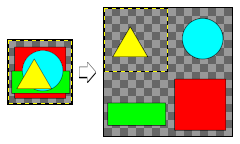

## Montage

This is a Gimp plug-in that arranges layers in a grid side by side.

### Installation
Copy **montage.py** in the plug-ins folder.  
The Windows path is `AppData\Roaming\GIMP\<version>\plug-ins\`

### Usage
Filters>Montage
